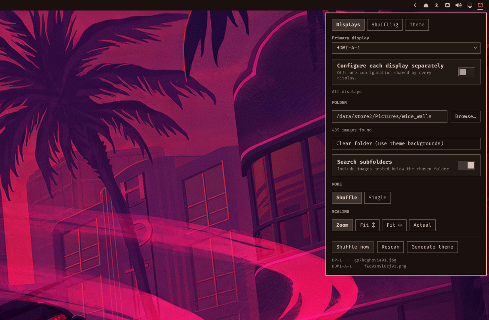

# omawall

A folder-backed wallpaper service for [Omarchy](https://omarchy.org) Quattro.

Point it at a directory of images and every display gets its own random
wallpaper, with an optional auto-shuffle timer and a bar widget to drive it.
With no folder configured it behaves exactly like Omarchy's built-in
background service, so you can install it and decide later.



## What it does

- **Per-display wallpapers** — each monitor is dealt its own pick from the pool
  instead of mirroring one image across all of them.
- **Every image before any repeat** — picks come off one shuffled queue that is
  reshuffled only when it empties, so a folder of 500 wallpapers shows all 500
  before any comes round again. Sampling at random instead would leave roughly
  a third of a folder unseen over the same number of shuffles while showing
  others three or four times.
- **Auto-shuffle** — reshuffle every _n_ seconds, or leave it at `0` and
  shuffle by hand.
- **Recursive scanning** — optionally include images nested below the chosen
  folder. Picks up `.jpg`, `.jpeg`, `.png`, `.gif`, `.bmp` and `.webp`.
- **Undecodable files are skipped** — a file too large for Qt's image
  allocation limit, truncated, or misnamed is dropped from the pool the first
  time it fails and the affected display is dealt another image instead. The
  panel reports how many were skipped; a rescan retries them.
- **Theme from wallpaper** — optionally derive an Omarchy theme from the image
  on your primary display and switch to it, so the bar, terminal, editor and
  everything else Omarchy themes follow the picture behind them. See
  [Theme from wallpaper](#theme-from-wallpaper).
- **Theme switches still work** — `omarchy theme set` keeps applying its color
  payload and recoloring the bar. Only the choice of image is taken over.
- **Bar widget** — a wallpaper icon that opens a settings panel: browse for a
  folder, toggle the options, shuffle, rescan, and see which image landed on
  which display. Middle-click the icon to shuffle without opening the panel.

## Install

```bash
omarchy plugin add https://github.com/matjam/omawall.git --enable
```

That clones the repo into `~/.config/omarchy/plugins/matjam.omawall/`,
validates it, and offers to place the bar widget. Answer the placement prompt
with `right` (or wherever you want the icon).

Enabling omawall disables Omarchy's built-in `omarchy.background` service —
the two would otherwise fight over the same wallpaper. Disabling omawall
restores it.

To update later:

```bash
omarchy plugin update matjam.omawall
```

## Uninstall

```bash
omarchy plugin remove matjam.omawall
```

This disables the plugin, restores `omarchy.background`, and deletes
`~/.config/omarchy/plugins/matjam.omawall/`. Nothing is left behind outside
that directory; all settings live in your `~/.config/omarchy/shell.json`
entry for the widget and are removed with it.

## Usage

Click the wallpaper icon in the bar to open the settings panel.

| Setting | Default | Meaning |
| --- | --- | --- |
| Wallpaper folder | _(empty)_ | Directory to draw images from. Empty means "use the current theme's backgrounds". |
| Search subfolders | on | Scan recursively below the folder. |
| Different image per display | on | Deal each monitor its own pick rather than mirroring one image. |
| Auto-shuffle every | `0` | Seconds between automatic reshuffles. `0` disables it. |
| Generate theme from wallpaper | off | Rebuild the `omawall` theme on every wallpaper change. |
| Primary display | _(automatic)_ | Output whose image drives the theme. Automatic uses the first connected display. |
| Light theme | off | Generate a light palette instead of a dark one. |

Keyboard shortcuts while the panel is open:

| Key | Action |
| --- | --- |
| `s` | Shuffle now |
| `r` | Rescan the folder |
| `b` | Browse for a folder |
| `t` | Generate the theme now |

### From the command line

```bash
omarchy-shell background shuffle        # reshuffle every display now
omarchy-shell background rescan         # re-read the folder
omarchy-shell background generateTheme  # rebuild the theme from the current wallpaper
omarchy-shell background status         # JSON: pool size, current pick per screen, theme settings
```

Handy as a Hyprland bind:

```
bind = SUPER SHIFT, W, exec, omarchy-shell -q background shuffle
```

## Theme from wallpaper

With **Generate theme from wallpaper** on, every wallpaper change derives a
palette from the image on your primary display, writes it to
`~/.config/omarchy/themes/omawall/colors.toml`, and applies it. Everything
Omarchy themes follows: the bar, terminals, btop, neovim, the browser, VS Code.

Leave the toggle off and press `t` (or run `omarchy-shell background
generateTheme`) to refresh the palette by hand instead, keeping it fixed while
wallpapers continue to shuffle.

The wallpaper is never changed by this. The theme is applied with
`OMARCHY_THEME_SKIP_BACKGROUND=1`, the same way `omarchy-theme-refresh` does it
— which is what keeps a shuffle from triggering a theme change that triggers
another shuffle.

Switching to any other theme turns the result off in practice: the next
generation switches straight back to `omawall`. Turn the toggle off first if
you want to pick a theme and keep it.

### How the palette is built

[matugen](https://github.com/InioX/matugen) extracts Material You tonal
palettes from the image. Its surface and on-surface tiers map directly onto
Omarchy's background and foreground ramps, and its primary becomes the accent.

The eight ANSI colors cannot come from matugen. Material You harmonises a whole
scheme around one seed hue, so its base16 output is a monochrome ramp — every
"color" a different lightness of the same hue. A terminal needs red to be red.
So those are synthesised: each starts at its canonical hue, is nudged up to 15°
toward the image's hue (the same harmonisation Material applies to custom
colors), and is rendered at a saturation taken from the image and held inside a
band, so a near-grey wallpaper still yields colors you can tell apart. The
mapping lives in [`bin/omawall-colors.jq`](bin/omawall-colors.jq).

You can run the generator directly:

```bash
bin/omawall-generate-theme --image ~/Pictures/wall.jpg --mode dark
bin/omawall-generate-theme --image ~/Pictures/wall.jpg --no-apply  # write only
```

## Requirements

- Omarchy Quattro (the Quickshell-based `omarchy-shell`).
- `zenity` — used only by the panel's **Browse…** button. Without it you can
  still type or paste a path into the folder field. Omarchy ships it by
  default.
- `matugen` — required only for **Theme from wallpaper**; everything else works
  without it, and the panel says so when it is missing. It is in Arch's
  official `extra` repository, no AUR needed:

  ```bash
  sudo pacman -S matugen
  ```

  matugen is GPL-2.0. omawall only executes it as a separate process, so the
  two licenses stay independent.

`jq` and `find` are used by the generator and ship with Omarchy. No network
access, and nothing is written outside `~/.config/omarchy`.

## Credits

Derived from Omarchy's built-in `omarchy.background` plugin
([basecamp/omarchy](https://github.com/basecamp/omarchy), MIT) and extended
with folder mode, per-display picks, auto-shuffle, theme generation, and the
settings panel.

## License

MIT — see [LICENSE](LICENSE).
